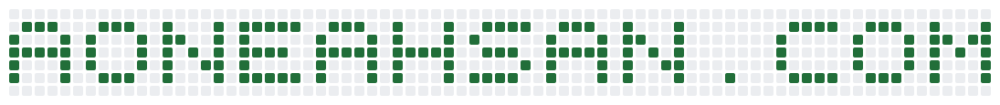

  <a href="https://aoneahsan.com" aria-label="AONEAHSAN.COM">
    <picture>
      <source media="(prefers-color-scheme: dark)" srcset="./contribution-banner-dark.svg">
      
    </picture>
  </a>

<h1 align="center">
  <a href="https://aoneahsan.com">AONEAHSAN.COM</a>
</h1>

  <b>Ahsan Mahmood</b> &middot; Full-Stack Software Developer &middot; SaaS Specialist

---

## Hi there 👋

I'm Ahsan Mahmood, a full-stack software developer focused on SaaS products. I have six years of professional experience, and my active, up-to-date portfolio lives at **[aoneahsan.com](https://aoneahsan.com)**.

### What I build

- **SaaS web apps** &mdash; React + TypeScript front-ends on Firebase, built mobile-first and responsive.
- **Cross-platform mobile apps** &mdash; web and Android from a single Capacitor codebase (iOS-ready).
- **Browser extensions** &mdash; for Chrome, Firefox, and Edge.
- **Open-source npm packages** &mdash; published at [npmjs.com/~aoneahsan](https://www.npmjs.com/~aoneahsan).

For the full, current list of projects and packages, visit **[aoneahsan.com](https://aoneahsan.com)**.

### Contact

- Mobile / WhatsApp / Imo: [+923046619706](tel:+923046619706)
- Email: [aoneahsan@gmail.com](mailto:aoneahsan@gmail.com)
- LinkedIn: [linkedin.com/in/aoneahsan](https://linkedin.com/in/aoneahsan)
- GitHub: [github.com/aoneahsan](https://github.com/aoneahsan)
- npm: [npmjs.com/~aoneahsan](https://www.npmjs.com/~aoneahsan)
- Resume (Full-Stack Developer): [aoneahsan.com/resume](https://aoneahsan.com/resume)
- CV (Complete Work History): [aoneahsan.com/cv](https://aoneahsan.com/cv)
- Skype: `live:aoneahsan`

### Thanks for stopping by &mdash; have a great day!
